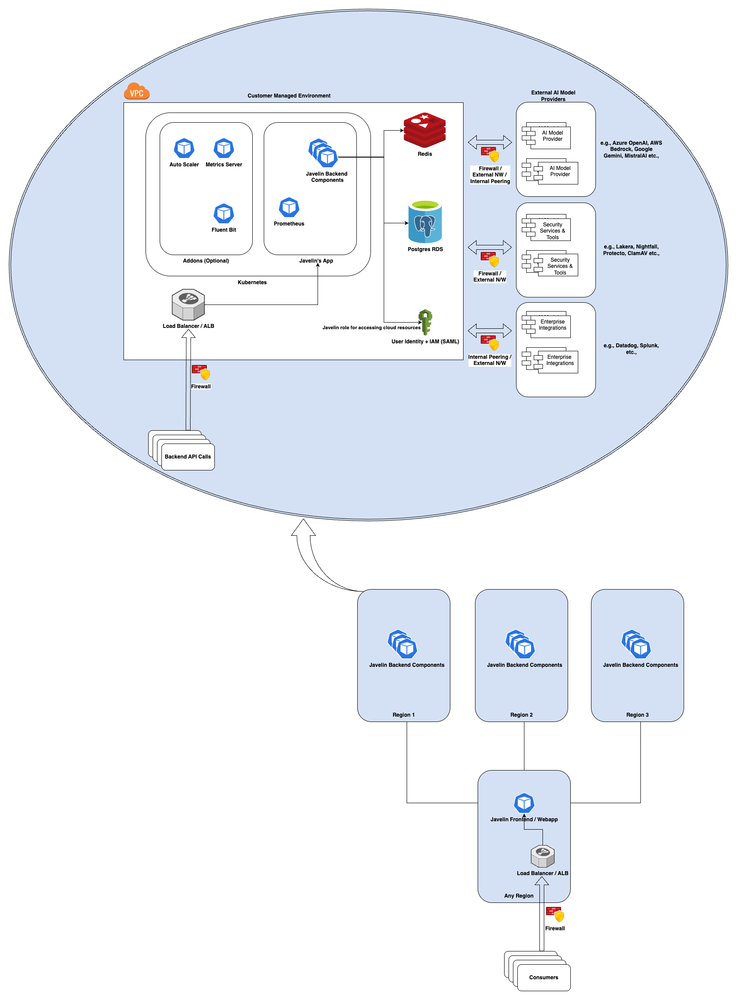
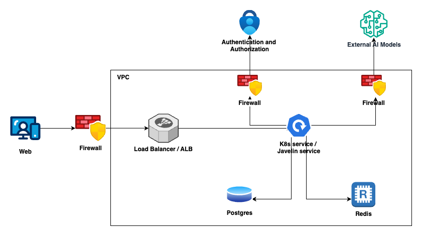

# javelin-iac

## Architecture Diagram

This architecture diagram represents the deployment the Javelin AI Gateway Application, highlighting the infrastructure components, their relationships. It demonstrates how the deployment leverages Cloud services and resources for reliability, scalability, security, and cost-effectiveness.



## Networking Diagram

The following diagram illustrates the key networking components, including VPCs, firewall, load balancers, and compute resources.



### Key Components

* **VPC (Virtual Private Cloud)**:
    - The foundational network layer isolating resources securely. Subnets are typically segmented by availability zones (AZs) for high availability.
* **Subnets**:
    - **Public Subnets**: Hosts public-facing components like load balancers.
    - **Private Subnets**: Secured subnets for application servers, databases, and backend services, without direct internet access.
* **NAT Gateway**:
    - Allows outbound internet access for resources in private subnets.
* **Internet Gateway**:
    - Enables resources in a VPC to access the internet.
* **Load Balancer**:
    - Distributes incoming traffic across the Kubernetes deployment to ensure reliability and balance workloads.
* **Kubernetes**:
    - Cloud managed service for Kubernetes to deploy the microservices.
* **Database**:
    - We are using managed Postgres service from the cloud provider, providing persistent storage backend enabled.
* **Redis**:
    - Cloud managed Redis we are using for cache service.
* **IAM (Identity and Access Management)**:
    - Have one custom IAM role which is binding with Kubernetes service account for the specific microservice.
* **Cloud Provider Logging System**:
    - Monitoring and observability for metrics, logs, and alarms, helping maintain visibility into application health and performance.

## 🔒 Security Considerations

- All external inbound and outbound traffic is encrypted (HTTPS, TLS 1.2+)
- IAM policies enforce least privilege
- Application Logs enabled for monitoring and debugging
- Firewall open only required ports for traffic

**ℹ️ IMPORTANT NOTICE**

This Terraform configuration is designed for general cloud provider environments without any custom networking or VPC-level policies. 

If your organization enforces specific network or cloud provider policies, please fork this repository and adjust the Terraform code accordingly to ensure compliance with your organization's standards.

## Directory Structure

* cloud : Contains the cloud providers `(example : aws, gcp... etc)` specific terraform code

    * The sub folder structure should be something as this, an example for aws environment : `cloud/aws/aws_acc_id/poc/`

    * Here, 

        * `aws_acc_id` is the AWS account ID

        * `poc` is an environment name under the `aws_acc_id` and there can be `N` number of sub folder such as `test`, `stage`, `prod` etc...

        * Within `poc` environment folder, there will be the following sub folders

            * `infra-setup` : Cloud resource setup

            * `k8s-addons` : Kubernetes Addons and javelin dependencies

* config : Configurations for the infra and dependencies deployment into Kubernetes specific to each environment

    * The `config` folder having these items,

        * `common` : This directory contain configuration files for any resources that is common for all environment

        * `aws` : Cloud specific config files

            * `poc` : Environment specific configuration files, this folder is for `poc` environment

* modules : Reusable terraform modules which will be called from `cloud` folder

## Onboarding a New Environment

### AWS Environment

To add a new `aws environment` for Javelin. consider the environment name is `test`, follow these steps

#### Prerequisites

* An AWS Account

* Linux terminal in local for running Terraform Code

* Admin permission / Permission to all of the resources mentioned in the terraform from local

* AWS ACM Certificates for the following items

    * `backend domain certificate` (javelin-test-api.example.com)

    * `eval domain certificate` (javelin-test-eval.example.com)

    * `frontend domain certificate` (javelin-test.example.com)

#### Steps

* Create a new AWS environment config folder called `test` by copying `config/aws/poc` into `config/aws/test`

    * Customize the config files accourding to your environment if required under `config/aws/test` folder

* Create a new AWS environment terraform code folder called `test` by copying `cloud/aws/aws_acc_id/poc` into `cloud/aws/aws_acc_id/test`

    * `infra-setup` Terraform Code

        * Update the infra env file `cloud/aws/aws_acc_id/test/infra-setup/env.tfvars`

        * Make sure these two files haveing the same values for `region` and `bucket`

            * `cloud/aws/aws_acc_id/test/infra-setup/env.tfvars`

            * `cloud/aws/aws_acc_id/test/infra-setup/backend.tfvars`

        * One time setup - in the first run, the backend S3 bucket not available and so need to create it first

            * Disable all the infrastructure creation by updating the file `cloud/aws/aws_acc_id/poc/infra-setup/env.tfvars`

                ```bash
                enable_vpc                               = false
                enable_postgres                          = false
                enable_redis                             = false
                enable_eks                               = false
                enable_alb_sg                            = false
                enable_svc_iam                           = false
                ```

            * Comment out these lines from the file `cloud/aws/aws_acc_id/poc/infra-setup/provider.tf`

                ```bash
                # backend "s3" {
                #    use_lockfile   = true
                #    encrypt        = true
                #    key            = "infrasetup/infrasetup.tfstate"
                # }
                ```

            * Initialize terraform by running this command `terraform init -backend-config="backend.tfvars"`

            * Apply the changes by running `terraform apply -var-file="env.tfvars"`, This will create the S3 bucket for TF backend

            * Uncomment these lines from the file `cloud/aws/aws_acc_id/poc/infra-setup/provider.tf`

                ```bash
                backend "s3" {
                    use_lockfile   = true
                    encrypt        = true
                    key            = "infrasetup/infrasetup.tfstate"
                }
                ```

            * Run terraform initialization command again and this will migrate the local state file into S3 bucket. `terraform init -backend-config="backend.tfvars"`

        * Enable all the infrastructure creation by updating the file `cloud/aws/aws_acc_id/poc/infra-setup/env.tfvars`

            ```bash
            enable_vpc                               = true
            enable_postgres                          = true
            enable_redis                             = true
            enable_eks                               = true
            enable_alb_sg                            = true
            enable_svc_iam                           = true
            ```

        * Run these commands to create all resources specified in the code

            ```bash
            terraform init -backend-config="backend.tfvars"
            terraform plan -var-file="env.tfvars" # Optional for listing the resources that is going to create
            terraform apply -var-file="env.tfvars"
            ```

    * `k8s-addons` Terraform Code

        * Run this command to download the kubconfig file for communicating with EKS from local for deploying the dependencies

            * Here for kube config file, I gave the name `~/.kube/javelin-poc-eks.json`, it should match with the variable `local_kube_config` in the file `cloud/aws/aws_acc_id/test/k8s-addons/env.tfvars`

            ```bash
            export KUBECONFIG=~/.kube/javelin-poc-eks.json ; aws eks update-kubeconfig --name javelin-poc-eks
            ```

        * Update the kubernetes addons env file `cloud/aws/aws_acc_id/poc/k8s-addons/env.tfvars`

        * Make sure these two files haveing the same values for `region` and `bucket`

            * `cloud/aws/aws_acc_id/test/k8s-addons/env.tfvars`

            * `cloud/aws/aws_acc_id/test/k8s-addons/backend.tfvars`

        * Enable required components to be deployed in the kubernetes by updating the file `cloud/aws/aws_acc_id/poc/k8s-addons/env.tfvars`

            ```bash
            enable_namespace                = true
            enable_docker_secret            = true
            enable_storageclass             = true
            enable_autoscaler               = true
            enable_fluent_bit               = true
            enable_ingress_alb_crds         = true
            enable_ingress_alb              = true
            enable_prometheus               = true
            enable_grafana                  = true
            enable_metrics_server           = true
            ```

        * Run these commands to create all resources specified in the code

            ```bash
            terraform init -backend-config="backend.tfvars"
            terraform plan -var-file="env.tfvars" # Optional for listing the resources that is going to create
            terraform apply -var-file="env.tfvars"
            ```

* Create `CNAME` records for those 3 domain name with the ALB domain
