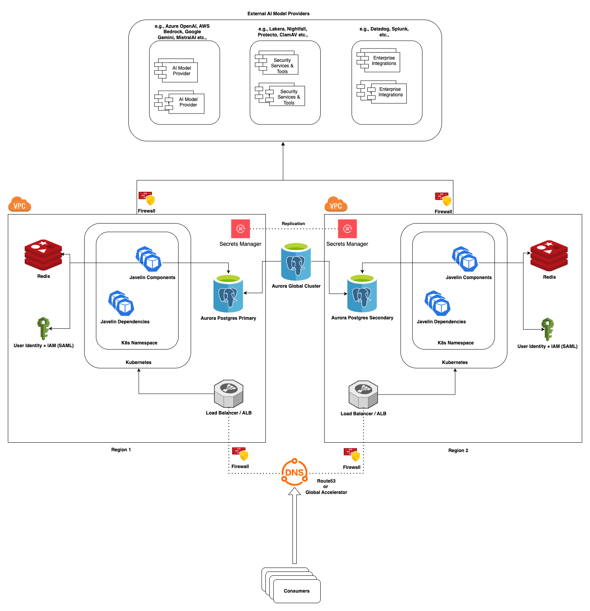

## Architecture Diagram

This architecture diagram represents the deployment the Javelin AI Gateway Application, highlighting the infrastructure components, their relationships. It demonstrates how the deployment leverages Cloud services and resources for reliability, scalability, security, and cost-effectiveness.

## Cross Region Architecture Diagram (AWS Specific)

Javelin AI Gateway can be deployed in cross region if the cloud provider meets the cross region HA requirements. The below diagram represents the cross region deployment of Javelin AI Gateway in AWS.

**ℹ️ IMPORTANT NOTICE**

The Terraform doesn't support the cross region deployment. If you are choosing cross region deployment, then please fork this repository and adjust the Terraform code accordingly to ensure that the following resources configured properly

* `AWS Application Load Balancer` cross region dns based failover setup, you can find the offical docs [here](https://docs.aws.amazon.com/whitepapers/latest/real-time-communication-on-aws/cross-region-dns-based-load-balancing-and-failover.html)

### Before you start

Achieving HA comes at a cost. The environment requirements are sizable as each component needs to be multiplied, which comes with additional actual and maintenance costs. you can achieve distributed environments in different regions by accepting the following considerations

* Most of the routes are region specific, for example `bedrock models`, If the region 1 goes down then the bedrock in that region is not accessible even our Javelin is available in the second region. So the route should be always region specific

* The Database won't be in sync, each cluster will have its own data and stored separately

* Each cluster must have same sets of gateweay and routes with api keys with exact same name. currently this need to be set manually from the UI

* The Cloud provider need to support DNS specific health check and route traffic to both cluster (Route53 or Global loadbalancer)

## Networking Diagram

The following diagram illustrates the key networking components, including VPCs, firewall, load balancers, and compute resources.

### Key Components

* **VPC (Virtual Private Cloud)**:
    - The foundational network layer isolating resources securely. Subnets are typically segmented by availability zones (AZs) for high availability.
* **Subnets**:
    - **Public Subnets**: Hosts public-facing components like load balancers.
    - **Private Subnets**: Secured subnets for application servers, databases, and backend services, without direct internet access.
* **NAT Gateway**:
    - Allows outbound internet access for resources in private subnets.
* **Internet Gateway**:
    - Enables resources in a VPC to access the internet.
* **Load Balancer**:
    - Distributes incoming traffic across the Kubernetes deployment to ensure reliability and balance workloads.
* **Kubernetes**:
    - Cloud managed service for Kubernetes to deploy the microservices.
* **Database**:
    - We are using managed Postgres service from the cloud provider, providing persistent storage backend enabled.
* **Redis**:
    - Cloud managed Redis we are using for cache service.
* **IAM (Identity and Access Management)**:
    - Have one custom IAM role which is binding with Kubernetes service account for the specific microservice.
* **Cloud Provider Logging System**:
    - Monitoring and observability for metrics, logs, and alarms, helping maintain visibility into application health and performance.

## 🔒 Security Considerations

- All external inbound and outbound traffic is encrypted (HTTPS, TLS 1.2+)
- IAM policies enforce least privilege
- Application Logs enabled for monitoring and debugging
- Firewall open only required ports for traffic

## AWS Disaster Recovery (DR) Runbook

The DR setup in AWS cloud is an `active - passive cluster` in 2 different region, where one region will be always serve read and write traffic and another one read traffic until the switchover happen either via automatically or manually.

These are the steps we have to follow in manual DR process

* Do failover in the Aurora Global DB - this will switch the primary node and standby node across the region so the second region become read and write and first region will be read only

* Update the `Traffic dial` in the Global accelerator's `Endpoint groups` as below -  This can be done either via terraform or AWS console.

    * `active region` - Traffic dial must be `100`

    * `passive region` - Traffic dial must be `0`
