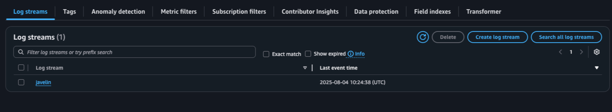
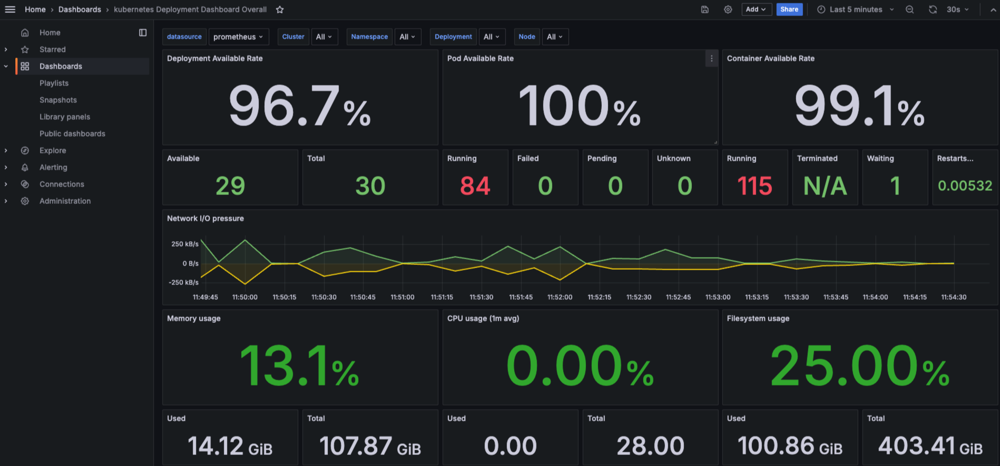
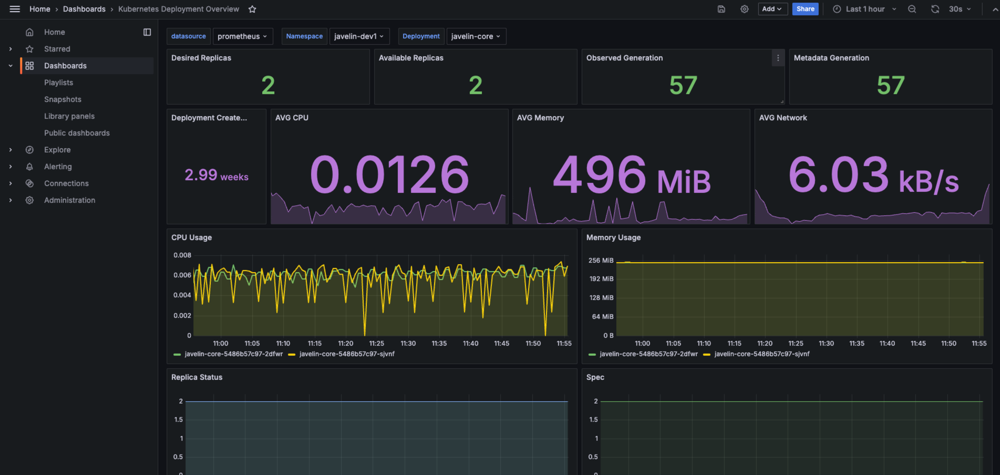
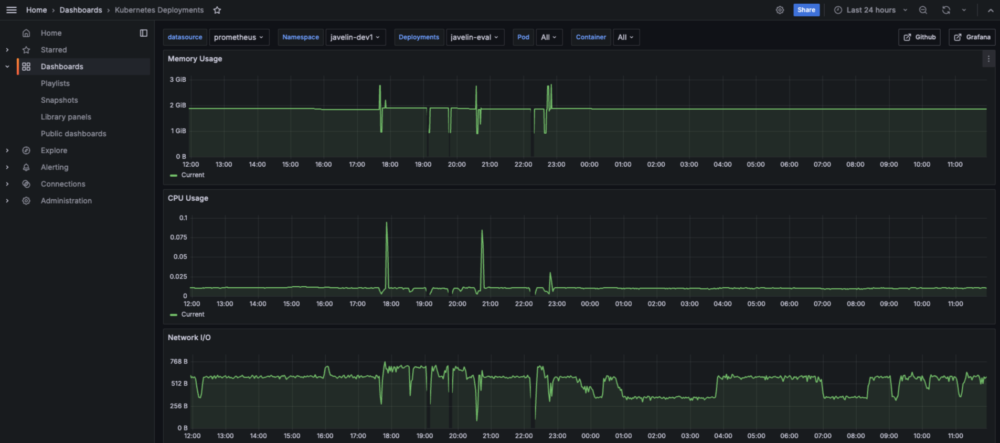
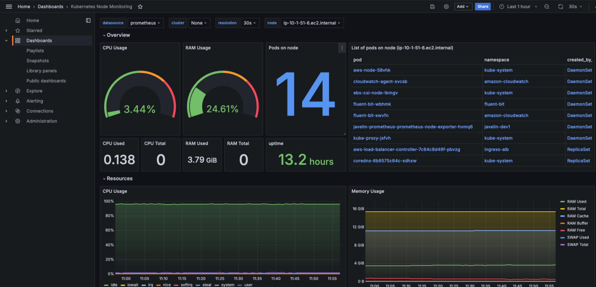

# Service Logging & Monitoring Setup (AWS Cloud)

This document outlines the configuration of logging and monitoring systems deployed in an Amazon EKS (Elastic Kubernetes Service) cluster. The setup includes:

- **Fluent Bit** for log forwarding
- **Amazon CloudWatch Logs** as the log storage backend
- **Prometheus** for metrics scraping
- **Grafana** for visualization

---

## 📄 Logging Architecture

### 🔧 Fluent Bit

Fluent Bit is deployed as a **DaemonSet** in the EKS cluster to collect logs from each node. It is configured to:

- Tail logs from `/var/log/containers/*.log` for each microsevrice deployed in the EKS
- Parse Kubernetes logs using the Kubernetes filter and create individual log group with the javelin service name
- Forward logs to **Amazon CloudWatch Logs** under the respective log stream name, the name match with the javelin service name

**IAM Permissions** for Fluent Bit (via IRSA) are configured to allow writing to CloudWatch Logs.

### 🔗 CloudWatch Logs Integration

Logs are sent to **CloudWatch Log Groups** in the following format:

`PROJECT_NAME-PROJECT_ENV-eks-service-log`. where,

- `PROJECT_NAME` is the `project_name` variable passing in the terraform code

- `PROJECT_ENV` is the `project_env` variable passing in the terraform code

within the log group, there will be many log streams representing each microservices as the diagram below.

---

## 📊 Monitoring Architecture

### 🔧 Prometheus

Prometheus is deployed as a **DaemonSet** in the EKS cluster with the following features:

- Scraping metrics from:

  - kubelet

  - cAdvisor

  - CoreDNS

  - Node exporter

**Persistent storage** is enabled via EBS volumes.

### 📈 Grafana

Grafana is deployed with:

- Prometheus as the data source

- Pre-built dashboards for:

  - kubernetes Deployment Dashboard Overall

  - Kubernetes Deployment Overview

  - Kubernetes Deployments

  - Kubernetes Node Monitoring

- Authentication via basic auth

#### Dashboards

###### 📈 kubernetes Deployment Dashboard Overall

###### 📈 Kubernetes Deployment Overview

###### 📈 Kubernetes Deployments

###### 📈 Kubernetes Node Monitoring

---

## 🔐 Security & Access

- **IAM roles for service accounts (IRSA)** are used to grant least-privilege permissions to Fluent Bit.

- Grafana access can be exposed via LoadBalancer or through an Ingress controller with HTTPS.

---